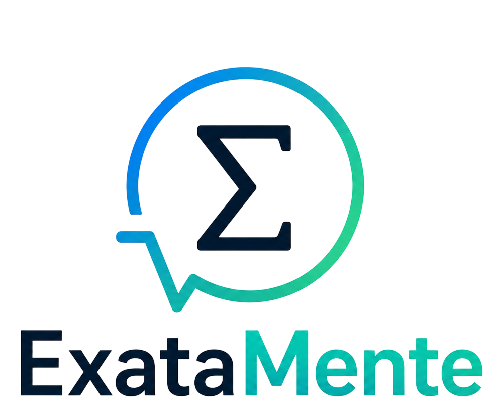

# ExataMente_Hackathon - Accenture Hackathon 2026
<div align="center">
  
  <h1>ExataMente (TutorMathIA)</h1>
  <p><strong>Solução de Orquestração Multi-Agente para Raciocínio Lógico e Tutoria Matemática</strong></p>
  <p><em>Desenvolvido durante o Hackathon da Accenture Portugal (Coimbra)</em> 🚀</p>
</div>

---

## 📌 O Problema
Atualmente, as Large Language Models (LLMs) enfrentam barreiras críticas ao lidar com lógica matemática rigorosa. Identificamos quatro falhas estruturais:
* **Alucinações Matemáticas:** A geração de dados factualmente incorretos apresentados como verdades absolutas.
* **Saltos Lógicos (Omissão de Etapas):** A IA ignora o processo intermediário, dificultando a validação humana e a auditoria do resultado.
* **Inabilidade de Resolução Complexa:** Dificuldade em manter a coerência em problemas que exigem múltiplos passos interdependentes.
* **Saídas de Resultado Único:** A entrega direta do resultado final sem a explicação do "porquê", limitando o valor educativo e profissional.

## 💡 A Nossa Solução
O **ExataMente** não é apenas "outra IA", mas sim um **Ecossistema Especializado**. 
Implementamos uma arquitetura onde as tarefas são divididas e validadas por agentes distintos. O raciocínio é decomposto, forçando a IA a "pensar em voz alta" , o que garante uma redução drástica de alucinações (fiabilidade operacional) e proporciona total transparência pedagógica.

---

## 🏗️ Arquitetura do Sistema e Workflow dos Agentes

O projeto utiliza um fluxo de orquestração com múltiplos agentes especializados:

1. 🚪 **Orquestrador (Gestor de Infraestrutura):** Atua como a "gateway" ou porta de entrada principal de todo o ecossistema. Recebe as solicitações do utilizador (texto ou imagem/OCR) e faz a triagem inicial e encaminhamento.
2. 🧠 **Professor (O Explicador Autêntico):** É o agente com interface direta para o utilizador, desenhado para ser didático. Identifica a natureza da equação e coordena os especialistas específicos necessários para resolver cada parte do problema.
3. 📚 **Especialistas de Domínio (Base de Conhecimento):** Módulos focados em áreas como Integração, Álgebra e Trigonometria. Eles consultam identidades, regras e tabelas fornecidas nos nossos documentos base para embasar tecnicamente a resposta.
4. 🧮 **Calculadora (Motor Simbólico):** Blinda o sistema contra erros de cálculo da IA, delegando a resolução exata à biblioteca Python `SymPy`.
5. 👨‍🏫 **Tutor (Síntese Pedagógica):** Elabora uma solução passo a passo, explicando cada conceito aplicado de forma clara e motivadora para o utilizador.

## 🛠️ Tecnologias Utilizadas
* **Linguagem:** Python 3.x
* **Orquestração e IA:** LangChain / Google Gemini Generative AI (`gemini-2.5-flash`)
* **Motor Matemático:** SymPy (Resolução matemática exata)
* **Gestão de Conhecimento (RAG Local):** Parsing de ficheiros Markdown e extração estruturada (JSON) para consulta rígida a `.pdf` e `.md` de suporte.

## 🏆 Contexto do Hackathon
Este projeto foi desenvolvido de raiz por uma **equipa de 4 pessoas** e submetido ao abrigo da categoria *Bring Your Own Use Case* no **Hackathon da Accenture Portugal em Coimbra**. A arquitetura cumpre rigorosamente os critérios exigidos pelo regulamento:
* ✅ **Abordagem baseada em Agentes:** Utiliza mais de 2 agentes de IA com responsabilidades distintas.
* ✅ **Viável em 6 horas:** O *core flow* foi construído e tornado demonstrável dentro do evento.
* ✅ **Ferramentas Gratuitas / Open Source:** Todos os *frameworks* (LangChain, SymPy) e APIs (Gemini em Free Tier) são gratuitos.
* ✅ **Sem dados confidenciais:** Toda a informação provém de bases de conhecimento públicas (tabelas e identidades matemáticas).

## 🚀 Como Configurar e Executar

1. **Instalar as Dependências**
   Recomenda-se a criação de um ambiente virtual (Virtualenv).
   ```bash
   pip install langgraph langchain langchain-openai langchain-google-genai sympy python-dotenv streamlit
2. **Alterar a chave da API**
   export GOOGLE_API_KEY="a-sua-chave-aqui"
2. **Para executar**
   python -m streamlit run app.py ou streamlit run app.py ou py -m streamlit run app.py
